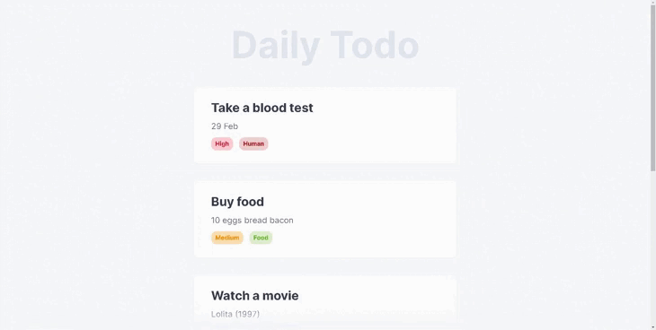

# TODO LIST

A TODO list with a minimalist design.

- Add your TODO to the list, give them a title, description, custom tags and priorities;
- Your TODO list isn't lost when the page reloads;
- Mark your TODO completed or delete irrelevant ones;
- Return completed TODO to the list.



## Technical stack, technologies

- HTML, CSS
- JavaScript
- Vue3
- Vite
- ESLint
- Tailwind
- Fontawesome
- Yup
- Pinia
- Vue-multiselect
- Vue3-colorpicker
- Vue3-toastify

## Project Setup

```sh
npm install
```

### Compile and Hot-Reload for Development

```sh
npm run dev
```

### Compile and Minify for Production

```sh
npm run build
```

### Lint with [ESLint](https://eslint.org/)

```sh
npm run lint
```
